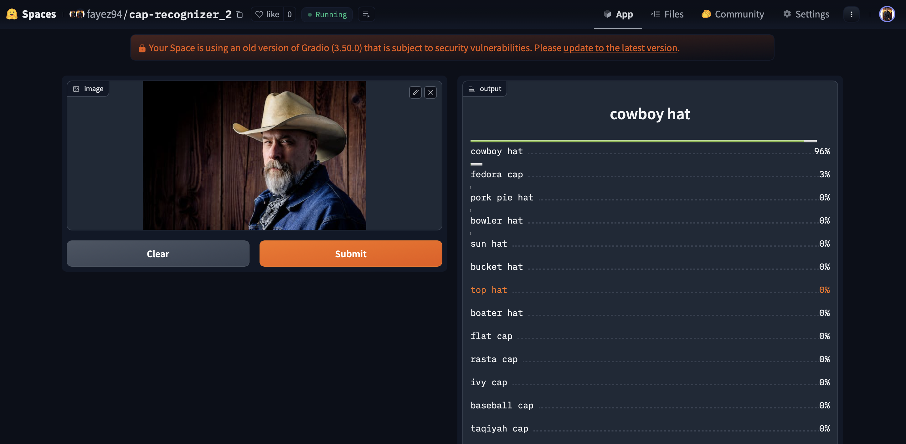

# Cap-Recognizer
An image classification model from data collection, cleaning, model training, deployment and API integration.  
The model can classify 20 different types of caps  
The types are following:  
1. baseball cap
2. beanie cap
3. fedora cap
4. cowboy hat
5. kepi cap
6. flat cap
7. trucker cap
8. newsboy cap
9. pork pie hat
10. bowler hat
11. top hat
12. sun hat
13. boater hat
14. ivy cap
15. bucket hat
16. balaclava cap
17. turban cap
18. taqiyah cap
19. rasta cap
20. visor cap

## 📌 Project Workflow

### 1️⃣ Problem Statement
Develop an AI-powered model to classify various types of caps from images.

### 2️⃣ Data Collection
- Used **DuckDuckGo** image search to collect images of **20 cap categories**.
- Automated image downloading with **FastAI’s `search_images_ddg` function**.
- Maintained a balanced dataset across all categories.

### 3️⃣ Data Preprocessing
- Removed duplicate and irrelevant images.
- Standardized image size to **224x224 pixels**.
- Applied **data augmentation** (rotation, flipping, zoom, lighting adjustments) for robustness.

### 4️⃣ Model Training
- Used **ResNet34** with **transfer learning**.
- Implemented **FastAI’s `cnn_learner`** for efficient training.
- Employed **cross-entropy loss** and **Adam optimizer**.
- Split dataset into **training and validation sets**.

### 5️⃣ Model Evaluation
- Achieved **94% accuracy** on the validation set.
- Analyzed misclassifications with a **confusion matrix**.
- Identified areas for improvement.

### 6️⃣ Model Deployment
- Exported model using `learner.export()`.
- Built an interactive **Gradio-based web interface**.
- Deployed the model on **Hugging Face Spaces**.

### 7️⃣ Future Improvements
- Expand dataset for better generalization.
- Experiment with **ResNet50 or EfficientNet** for higher accuracy.
- Implement **active learning** for dataset refinement.

## Data Collection and Preparation

### Data Collection
The dataset was collected from DuckDuckGo using cap category names as search terms, ensuring diverse images for training.

### DataLoader
The **fastai DataBlock API** was used to set up the `DataLoader`, organizing the data into training and validation sets.

### Data Augmentation
**fastai** provides default GPU-accelerated data augmentations, improving the model's generalization.

For more details, check the [data_prep.ipynb](notebooks/data_prep.ipynb) notebook.

## Training, Data Cleaning, and Inference

### **Training**
The model was fine-tuned using **ResNet34** for 5 epochs, repeated 3 times, achieving an accuracy of approximately **89%**.

### **Data Cleaning**
Data cleaning was the most time-consuming part of the process. Since the data was collected from a browser, there was a significant amount of noise, and some images contained irrelevant content. To clean and update the dataset, I used the **fastai ImageClassifierCleaner**.

Data cleaning was performed after each training or fine-tuning session, except for the final iteration, which represented the final model.

### **Inference**
For inference, the trained model is used to classify new cap images. The **fastai Learner** was utilized to load the fine-tuned model and make predictions. This allows the model to classify unseen cap images accurately, based on the learned patterns during training.

Details can be found in [training_cleaning_inference.ipynb](notebooks/training_cleaning_inference.ipynb)

## Model Deployment

The model was deployed to **HuggingFace Spaces** as a Gradio app. You can access the deployed app [here](https://huggingface.co/spaces/fayez94/cap-recognizer_2).  
The implementation can be found in the `deployment` folder.

## API Integration with GitHub Pages

The deployed model API is integrated into a **GitHub Pages** website. You can view the integration [here](https://fayez94.github.io/Cap_Recognizer/docs/cap_recognizer.html).  
Implementation and other details are available in the `docs` folder.

## Contributions

Contributions are always welcome! If you'd like to contribute to the Cap Recognizer project, here’s how you can help:

### How to Contribute:
1. Fork the repository
2. Create a new branch (`git checkout -b feature-name`)
3. Make your changes
4. Commit your changes (`git commit -m 'Add new feature'`)
5. Push to the branch (`git push origin feature-name`)
6. Open a Pull Request

### Ways You Can Contribute:
- Add support for new cap categories or labels
- Improve the accuracy of the model by fine-tuning or experimenting with new architectures
- Enhance data collection or augmentation techniques
- Update documentation or add more examples
- Report bugs or suggest new features

Thank you for considering contributing! 🙏

## 📬 Contact
For any questions or suggestions, feel free to reach out!

📧 Email: mdfayezullah2624@gmail.com  
🐙 GitHub: [fayez94](https://github.com/fayez94)
